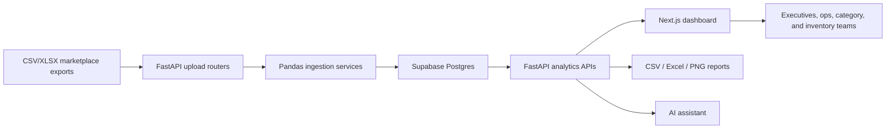
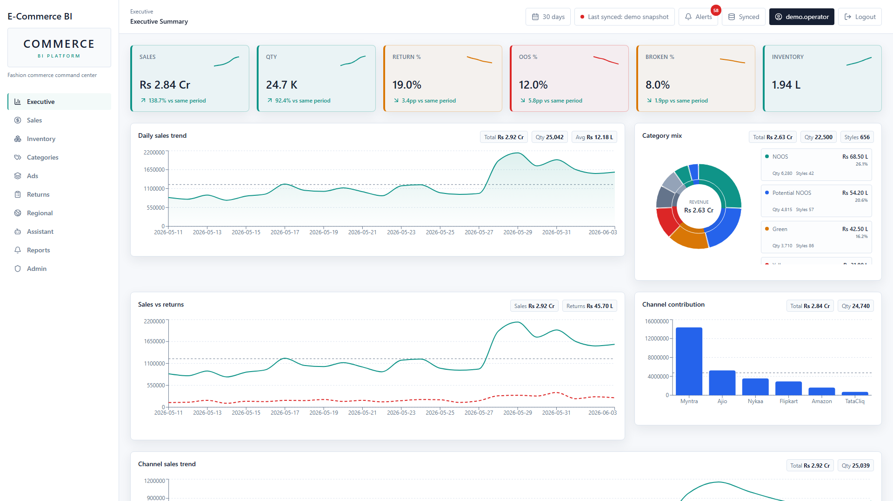
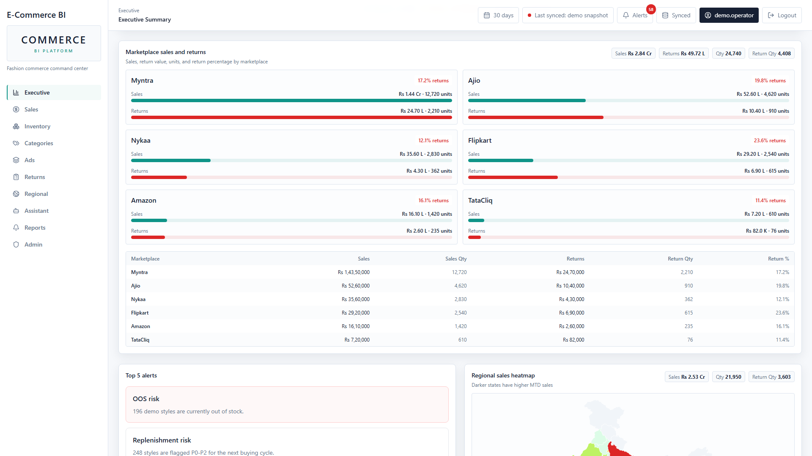
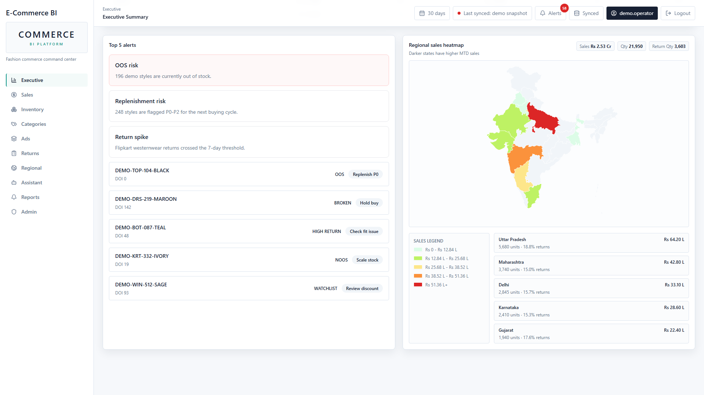

# E-Commerce BI Platform - Public Portfolio Copy

A production-level full-stack business intelligence platform for fashion e-commerce brand operations. The app ingests marketplace sales, inventory, returns, advertising, visibility, and sale-grade files, then turns them into executive KPIs, category decisions, replenishment recommendations, anomaly alerts, and downloadable business reports.

This repository is a public portfolio-safe version. Real credentials, raw business exports, generated reports, and production data are intentionally excluded.

## Highlights

- Full-stack BI app with FastAPI, Next.js, Supabase Postgres, and Tailwind CSS.
- Secure Supabase Auth with role-based access for admin, management, analyst, MD, and viewer users.
- Daily upload center for sales, inventory, returns, ads, visibility, SKU mapping, and sale-grade files.
- Marketplace analytics across Myntra, Ajio, Nykaa, Flipkart, Amazon, and TataCliq.
- Executive dashboard with MTD KPIs, sales trends, channel mix, category mix, sales-vs-returns, and regional map views.
- Inventory dashboard with OOS, broken stock, DOI, replenishment priority, category/status matrix, and CSV downloads.
- Category engine for NOOS, Potential NOOS, Green, Yellow, Red, Dead, Winter, Dog styles, Discontinue, Watchlist, and launch/repeat statuses.
- Returns and sales reports with export safety for CSV/Excel formula injection protection.
- AI assistant integration with Claude first and OpenAI fallback.
- Anomaly alert system for style-level sales spikes, return spikes, overstock risk, and category inventory movement.
- Deployment-ready backend and frontend configs for Railway and Vercel.

## Tech Stack

| Layer | Technology |
| --- | --- |
| Backend | FastAPI, Pydantic, Pandas, Supabase Python client |
| Frontend | Next.js App Router, React, TypeScript, Tailwind CSS |
| Charts | Recharts, react-simple-maps |
| Auth | Supabase Auth plus custom role table |
| Database | Supabase Postgres with migrations and RLS policies |
| AI | Anthropic Claude with OpenAI fallback |
| Notifications | Twilio WhatsApp and Resend email integrations |
| Deployment | Docker, Railway, Vercel |
| Testing | Pytest, Next.js build validation |

## Architecture



## Screenshots

The screenshots below are rendered from the repo's public `/demo` route using sample data, so recruiters can view realistic dashboard output without private credentials or live business data.







## Main Capabilities

### Executive Analytics

- MTD sales, quantity, ASP, returns, OOS, broken stock, and inventory KPIs.
- Daily sales trend and sales-vs-returns comparison.
- Marketplace and channel contribution views.
- Category mix and India regional heat map.

### Sales And Returns

- Channel-wise daily sales trends.
- Marketplace sales/return summaries.
- Top products by revenue, ROS, growth, and return percentage.
- Same-period growth comparisons.
- Return trend, high-return SKU analysis, and returns report downloads.

### Inventory And Replenishment

- Current inventory health by style and status.
- DOI rules for OOS and zero-ROS stock.
- Category/status matrix with style counts and inventory sums.
- Replenishment priority planning with download support.

### Category Engine

- Rule-based category assignment with sale-grade overrides.
- Potential NOOS queue based on ROS and grade eligibility.
- Sale-grade master upload and category rebuild endpoint.
- Cross-analysis of old sale grade vs new category.

### Alerts And Reports

- Style-level anomaly alerts for sales spikes, return spikes, combined sales/return spikes, and overstock risk.
- Category-level movement alerts based on inventory depth and SKU count change.
- Filterable alert table and downloadable alert reports.
- Daily Sale & Return report, inventory report, returns report, replenishment report, and category report.

## Repository Layout

```text
backend/
  db/migrations/        Supabase schema and supporting tables
  routers/              FastAPI route modules
  services/             Ingestion, category, alert, report, and forecasting logic
  models/               Pydantic schemas
frontend/
  app/                  Next.js App Router pages and API proxy routes
  components/           Dashboard UI, charts, forms, and layout components
  lib/                  API clients, auth helpers, formatting, date range helpers
  public/               Non-sensitive UI assets and map topology
tests/                  Backend and business-rule regression tests
```

## Local Setup

Prerequisites:

- Python 3.11
- Node.js 18 or later
- Supabase project

1. Clone the repo.

```powershell
git clone https://github.com/Sandy7217/ecommerce-bi-platform.git
cd ecommerce-bi-platform
```

2. Create environment files from examples.

```powershell
Copy-Item .env.example .env
Copy-Item frontend/.env.local.example frontend/.env.local
```

3. Fill in Supabase and optional integration credentials.

Backend `.env`:

```text
SUPABASE_URL=https://your-project-id.supabase.co
SUPABASE_ANON_KEY=your-anon-public-key-here
SUPABASE_SERVICE_KEY=your-service-role-secret-key-here
LEAD_TIME_DAYS=45
ENVIRONMENT=development
```

Frontend `frontend/.env.local`:

```text
NEXT_PUBLIC_SUPABASE_URL=https://your-project-id.supabase.co
NEXT_PUBLIC_SUPABASE_ANON_KEY=your-anon-public-key-here
NEXT_PUBLIC_API_URL=http://localhost:8001
```

4. Install dependencies.

```powershell
python -m pip install -r requirements.txt
npm install
```

5. Apply database migrations in Supabase SQL Editor.

```text
backend/db/migrations/001_initial.sql
backend/db/migrations/002_targets.sql
```

6. Start the backend and frontend.

```powershell
python -m uvicorn backend.main:app --host 0.0.0.0 --port 8001
npm run dev -- --port 3001
```

Open `http://localhost:3001`.

## Validation

Run the backend regression suite:

```powershell
python -m pytest -q
```

Run the frontend production build:

```powershell
npm run build
```

## Public Data And Secrets Policy

This portfolio repo does not include:

- Raw marketplace reports
- Real Supabase keys or project secrets
- `.env` or `frontend/.env.local`
- Generated reports, logs, screenshots with live business data, or Vercel local project files
- Git history from the private working repository

Use your own Supabase project and sample data to run the app.

## Engineering Notes For Recruiters

This project demonstrates:

- End-to-end BI system design from raw operational files to executive dashboards.
- Business-rule-heavy backend engineering with regression tests.
- Secure full-stack auth integration across server-rendered and client-rendered routes.
- Data ingestion with heterogeneous CSV/XLSX schemas.
- Dashboard UX for repeated operational use rather than marketing pages.
- Deployment hygiene for split frontend/backend hosting.

## License

Portfolio demonstration project. Add a license before using this code commercially.
